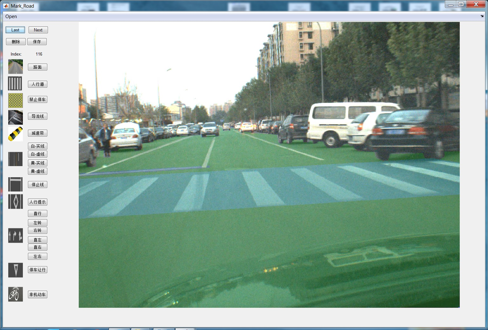

# TRoM_annotation_v1.0
This is the annotation toolkit for TRoM data set. It is written with MATLAB and the main function is impoly. It can provide a pixel-level annotation for the data set TRoM(Tsinghua road markings)

 + Try to keep the MATLAB version later than 2015a.
 + ./image is directory of the raw images. 
 + ./gt is the directory of the annotated images.
 + list.txt is the image list. If you want to mark more images, creat the list in advance.
 + This is the version which runs on windows. If you try to run on ubuntu or mac, modified the seperator.
 + When launch the MATLAB, run Mark_Road.m then the interface as figure above will be shown.
 + More shortcut is the same as impoly, you can refer to 'help impoly' in matlab command window.
 + This is the first version, we will release new versions in the future.
 + If you feel awkward to use this toolkit, welcome critic on this or email to me: xllau@126.com. Please call me xiaolong liu.
 The new URL is www.tromai.icoc.me/
 This is part of the paper work: Benchmark for Road Marking Detection: Dataset Specification and Performance Baseline. we will be happy if you cite us.
 
@inproceedings{xiaolong2017benchmark,   
title={Benchmark for Road Marking Detection: Dataset Specification and Performance Baseline},   
author={Xiaolong Liu, Zhidong Deng, Hongchao Lu, Lele Cao},   
booktitle={ITSC},   
year={2017} 
}

The download link is:
https://drive.google.com/drive/folders/0BzU3xph6la-TVm1pVUw4Ml9KMTg?resourcekey=0-fk0zYrM8xwcoCaOnCqFBtg&usp=sharing

